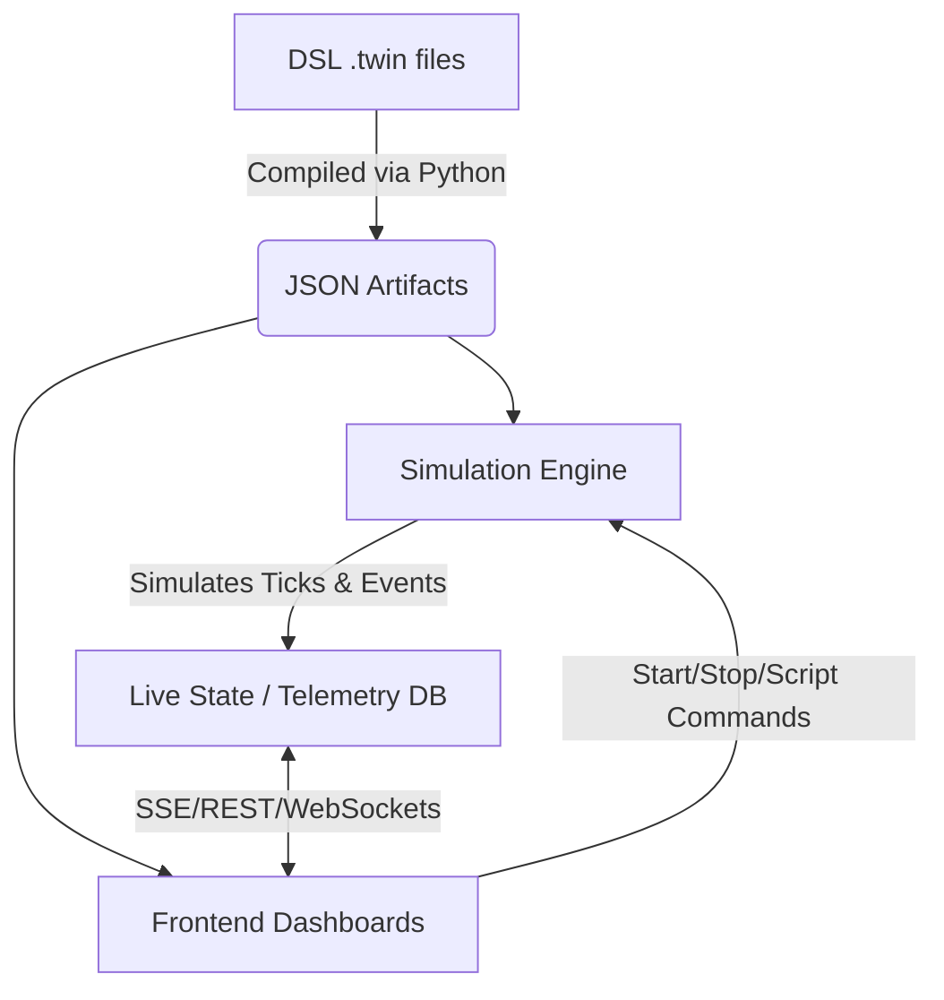

# PolarTwin: Canonical Project Context

This is the definitive, canonical knowledge base for the PolarTwin repository. It is designed to rapidly orient AI coding assistants and developers. **Do not modify this document unless the core architecture or conventions fundamentally change.**

---

## 1. Project Overview

**PolarTwin** is a comprehensive deterministic Digital Twin simulation platform designed for managing, simulating, and diagnosing Antarctic research stations. 

The project solves the problem of remote facility management by creating a highly accurate, scriptable simulated projection of a base's systems (power grids, fluid networks, sensor arrays, data pathways). The structural truth of the base is exclusively defined via a custom Domain-Specific Language (DSL) consisting of `.twin` files. The dynamic behaviors and disaster simulations are orchestrated using deterministic `.scene` and `.event` scripting files. 

**Maturity:** The project represents an advanced prototype/V2. It includes a custom compiler, a Python/FastAPI simulation core with deterministic tick-based execution, and a rich interactive frontend (React + Three.js + Cytoscape) for spatial and topological visualization.

---

## 2. AI Quick Context

### Project in One Paragraph
PolarTwin is a digital twin engine where the physical topology and logical constraints of an Antarctic base are statically compiled from custom `.twin` DSL files. A Python/FastAPI backend uses these compiled artifacts to run a deterministic simulation engine, streaming live telemetry to a React-based "Command Center" frontend that renders the base in both 3D (React Three Fiber) and hierarchical 2D node graphs (Cytoscape + ELK). 

### Technology Stack
*   **Language:** Python (Backend), TypeScript (Frontend)
*   **Frontend Framework:** React 19, Vite, React Router DOM
*   **Backend Framework:** FastAPI, Uvicorn
*   **Database (Telemetry):** SQLite (via custom `TelemetryDatabase` class)
*   **Frontend Data Visualization:** `@react-three/fiber` (3D), `cytoscape`, `cytoscape-elk`, `cytoscape-fcose` (2D topology graphs)
*   **Frontend Editor:** `@monaco-editor/react`
*   **Styling:** CSS variables, inline styles (no Tailwind unless explicitly enabled)
*   **Testing:** Vitest + React Testing Library (Frontend)
*   **Build/Lint:** `oxlint`, `tsc`, `vite build`

### Critical Rules & Architectural Constraints
1.  **Immutability from DSL:** The frontend NEVER invents layout, nodes, or connection semantics. Everything must flow from the compiled JSON generated from the `.twin` DSL.
2.  **Deterministic Simulation:** Do not introduce random variables or async race conditions into the simulation engine (`twin_sim`). Given the same state and `.scene` file, the simulation must produce identical outcomes.
3.  **Visualization Segregation:** The `TwinViewer.tsx` (3D space) and `ConnectionsPage.tsx` (Logical Topology) must remain synced via the same shared data models, but maintain specialized rendering pipelines.
4.  **No direct browser launching for testing:** Testing should rely on TS/Vite tools.
5.  **Strict Hierarchical Selection:** In topology graphs (`ConnectionsPage`), clicking empty parent areas strictly selects the parent border (without background flood or selecting children). Clicking a child strictly selects the child. Ancestry selection must not propagate accidentally.

---

## 3. Repository Directory Structure

```text
/
├── compiler/                  # The Python DSL compiler
│   └── parser/                # Parsers for hierarchy, connections, and specs
├── data/                      # The source of truth for the station
│   ├── source/Maitri/         # Raw .twin DSL files (hierarchy.twin, connection.twin, etc)
│   └── compiled/Maitri/       # JSON output from the compiler (spec.json, etc)
├── docs/                      # General project documentation
├── frontend/                  # React/TypeScript Vite application
│   ├── src/
│   │   ├── components/        # Reusable UI widgets (PropertyInspector, RightUIStack)
│   │   ├── pages/             # Major dashboard views (Overview, TwinViewer, ConnectionsPage)
│   │   └── lib/               # Shared frontend utilities
│   └── package.json           # Vite, React, Three.js, Cytoscape dependencies
├── src/
│   └── twin_sim/              # Core Python backend and simulation engine
│       ├── api/               # FastAPI route definitions (main.py, manager.py)
│       ├── compiler/          # Invocation logic for the DSL compiler
│       ├── simulation/        # Deterministic tick-engine and state management
│       ├── telemetry/         # SQLite persistence for historical simulation runs
│       └── scenarios/         # Executor for .scene and .event scripts
├── Dockerfile.api             # Backend deployment container
├── Dockerfile.web             # Frontend deployment container
└── IMPLEMENTATION_PLAN.md     # Original architectural specifications and rules
```

---

## 4. Architecture

### High-Level Architecture
PolarTwin operates on a strictly unidirectional data flow for station layout, and a bidirectional command/telemetry loop for simulation.



### Backend (Python/FastAPI)
The backend acts as both the build system (compiling DSL to JSON) and the runtime engine. The `SimulationManager` loads compiled artifacts into the `SimulationEngineCore`. Fast-paced telemetry updates are flushed to an SQLite DB and exposed via the FastAPI layer.

### Frontend (React/Vite)
The frontend relies heavily on large DOM/Canvas ecosystems (Three.js and Cytoscape). It manages state via custom React contexts (`SelectionContext`) and syncs simulation state via polling or streaming endpoints. Rendering performance is a massive priority due to the volume of nodes.

---

## 5. Application Flow (Simulation Lifecycle)

1.  **Boot:** FastAPI server (`main.py`) starts up. `lifespan` hook auto-discovers and registers all compiled stations in `DATA_DIR/compiled`.
2.  **Frontend Mount:** React mounts. Dashboards hit `/stations/{id}` to pull the topology JSON.
3.  **Visualization:**
    *   `TwinViewer.tsx` parses structural JSON to draw a 3D base.
    *   `ConnectionsPage.tsx` parses structural JSON to build the ELK layout node graph.
4.  **Simulation Trigger:** User opens `ScenariosPage.tsx` and executes a scenario via the API.
5.  **Tick Execution:** The backend `SimulationEngineCore` increments ticks, firing events and calculating structural cascades based on `.twin` specs.
6.  **Telemetry:** Telemetry is written to the database and pulled by the frontend. The `PropertyInspector` and `RightUIStack` re-render live values.

---

## 6. Important Files

*   **`frontend/src/pages/ConnectionsPage.tsx`**: The most complex rendering engine in the frontend. It uses Cytoscape and Eclipse Layout Kernel (ELK) to map hierarchical blocks and inter-parent connections deterministically. Requires deep understanding of Cytoscape styling to modify safely.
*   **`frontend/src/pages/TwinViewer.tsx`**: Uses React Three Fiber. Translates the 2D architectural JSON into 3D meshes and hit-boxes (raycasting).
*   **`frontend/src/components/PropertyInspector.tsx`**: The contextual sidebar. Relies on `liveStateRef` to update values without triggering expensive React re-renders on the main canvas components.
*   **`src/twin_sim/api/main.py`**: The FastAPI entry point. Defines all routes for station discovery, simulation controls, and telemetry access.
*   **`src/twin_sim/cli.py`**: The command-line interface for manual compilation, migration, and administrative simulation tasks.
*   **`data/source/Maitri/*.twin`**: The literal `.twin` DSL files representing the Maitri station. **Do not edit JSON directly; edit the `.twin` files and recompile.**

---

## 7. Data Model

### The DSL Topology Model
*   **Containers:** `campus` -> `station` -> `block` -> `floor` -> `system`
*   **Components:** `sensor`, `antenna`, `generator`, `controller`, `tank`
*   **Connections:** Typed edges (`power`, `data`, `fluid`) linking components, strictly validated.

### Simulation State
*   `component.json`: Real-time mutable state per node (load, heat, failure status).
*   `external.json`: Global variables mapped to the simulation (temperature, wind, radiation).

---

## 8. API Documentation (Inferred)

The primary API prefix routes through `/stations`:
*   `GET /`: Health check.
*   `GET /stations`: List compiled stations.
*   `GET /stations/{id}`: Get station manifest.
*   `GET /stations/{id}/hierarchy`: Retrieve tree of blocks and components.
*   `GET /stations/{id}/connections`: Retrieve all validated connections.
*   `GET /stations/{id}/runtime`: Retrieve initial static state values.

Simulation controls (`SimulationManager`):
*   `POST /simulations`: Create a simulation instance (takes `station_id` and optional `scenario_id`).
*   `POST /simulations/{id}/play`: Start the tick engine.
*   `GET /telemetry/...`: Historical query endpoints.

---

## 9. Configuration & Environment

| Variable   | Purpose                                      | Default                     | Used By         |
| ---------- | -------------------------------------------- | --------------------------- | --------------- |
| `DATA_DIR` | Root directory for DSL source and compilation| `data/`                     | `twin_sim` Core |
| `VERCEL`   | Flags if running in Vercel serverless        | `0`                         | Backend DB path |

---

## 10. Build & Development Workflow

### Frontend
```bash
cd frontend
npm install
npm run dev      # Start Vite dev server on port 5173
npm run lint     # Run oxlint
npm run test     # Run Vitest suite
npm run build    # Compile production bundle
```

### Backend
```bash
# In the repository root
pip install -r requirements.txt
PYTHONPATH=src uvicorn twin_sim.api.main:app --reload --port 8000
```

---

## 11. Known Issues / Technical Debt

1.  **Ref Transparency in Frontend:** `PropertyInspector.tsx` is currently throwing React Compiler/Lint warnings about accessing refs (`liveStateRef`) during the render cycle. This is an intentional performance hack to bypass React state thrashing for 10Hz telemetry, but it violates strict React immutability rules.
2.  **ScenariosPage `useMemo` Warning:** The `libraryTabContent` object is dynamically injected into `useMemo` without proper referential stability, triggering exhaustive-deps warnings in ESLint.
3.  **Cross-Parent Edge Complexity:** The implementation of inter-block wires in `ConnectionsPage.tsx` recently required a massive simplification. Hidden `bundle-edge` and `hub-node` elements exist in the DOM with `display: none` purely to anchor the ELK layout engine geometry. DO NOT remove them from the data structure, or the layout will collapse.

---

## 12. AI Modification Guidance

*   **Before Changing Frontend Layouts:** If modifying `ConnectionsPage.tsx`, recognize that it uses a strictly layered `cytoscape-elk` algorithm. Edges not meant for layout mapping (like `.real-edge`) MUST be excluded via `.not('.real-edge').layout(...)`.
*   **Before Modifying Station Structure:** **Never** edit `spec.json` or `hierarchy.json` directly. Edit the `.twin` files in `data/source/` and invoke the compiler.
*   **Architectural Constraints:** Do not attempt to merge `TwinViewer` and `ConnectionsPage`. They serve different operational purposes.
*   **State Management:** High-frequency data (like sensor telemetry) is intentionally kept out of React's `useState` hooks for global canvases to prevent re-rendering 5000 DOM nodes at 10Hz. Honor this pattern.

---

## 13. AI Context Summary

```text
PROJECT: PolarTwin
PURPOSE: Deterministic digital twin and simulation engine for Antarctic research stations.
PRIMARY STACK: Python (FastAPI, Custom DSL Compiler) + React 19 (TypeScript, Vite, Three.js, Cytoscape).
ARCHITECTURE: DSL compiles to Immutable JSON -> Backend simulates events/ticks over JSON -> Frontend visualizes.
ENTRY POINTS: src/twin_sim/api/main.py (Backend), frontend/src/main.tsx (Frontend).
CORE MODULES: ConnectionsPage.tsx (ELK graph), TwinViewer.tsx (3D), ScenarioManager (Simulation Engine).
DATA STORE: SQLite (Telemetry), Local Filesystem (.twin & compiled JSON).
IMPORTANT SERVICES: Uvicorn API Server, Custom Python Compiler.
KEY USER FLOWS: Compile DSL -> Boot Dashboard -> Execute Scenario -> Inspect Real-time Telemetry.
IMPORTANT FILES: hierarchy.twin, spec.twin, main.py, ConnectionsPage.tsx.
CRITICAL BUSINESS RULES: Frontend never mutates layout. Simulation must be 100% deterministic.
TESTING: Vitest/RTL (Frontend).
KNOWN RISKS: High-frequency telemetry React re-render optimization hacks (liveStateRef) bypass standard hooks. ELK graph geometry requires hidden invisible structural nodes to prevent collapse.
MODIFICATION GUIDELINES: Do not change the .twin JSON outputs manually. Do not change ELK layout config parameters when fixing visual graph bugs.
```
