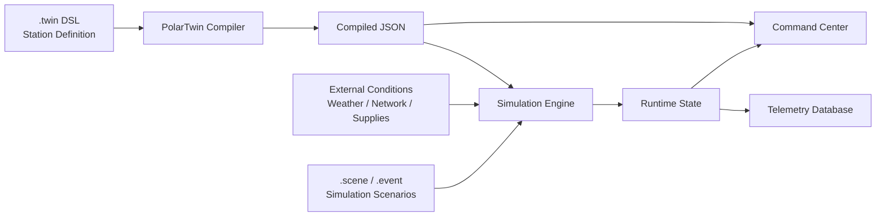
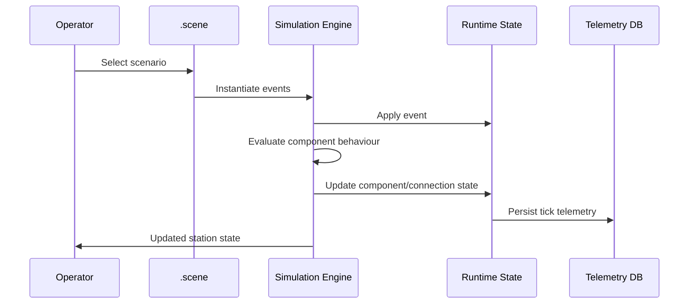
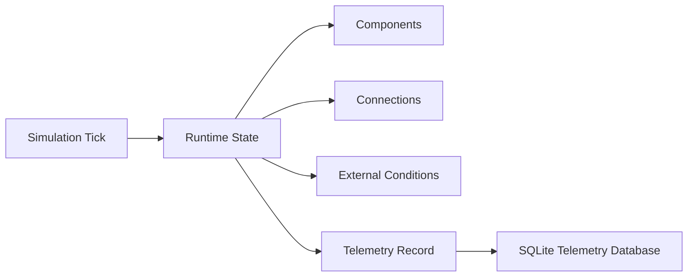
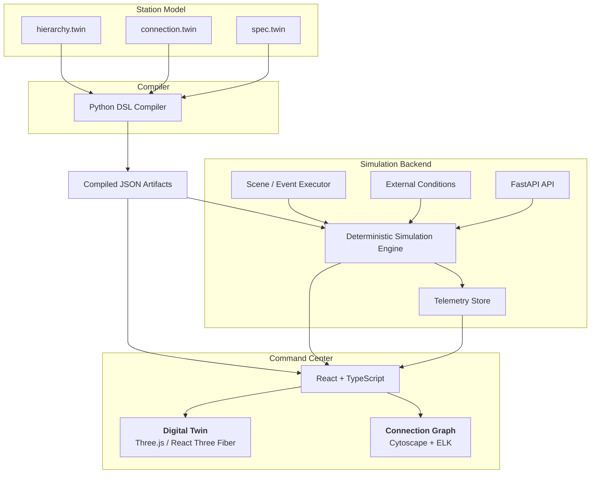

# PolarTwin

**A deterministic Digital Twin platform for efficient remote management of Indian Antarctic Research Stations**

PolarTwin is a **DSL-driven Digital Twin and simulation platform** designed for remote monitoring, simulation, diagnosis, and operational analysis of Antarctic research stations.

Developed for **SIH26060 — Digital Platform for efficient remote management of Antarctic research stations**, the platform models station infrastructure, energy and resource systems, connectivity, environmental conditions, sensors, and component dependencies in a unified digital environment.

The goal is to allow station operators and decision-makers to **observe system state, simulate failures and operational scenarios, understand cascading effects, and evaluate responses without requiring direct intervention in the physical station**.

## Overview

The project solves the problem of remote facility management by creating a highly accurate, scriptable simulated projection of a base's systems, such as power grids, fluid networks, sensor arrays, and data pathways. The structural truth of the base is exclusively defined via a custom Domain-Specific Language (DSL) consisting of `.twin` files. The dynamic behaviors and disaster simulations are orchestrated using deterministic `.scene` and `.event` scripting files.

PolarTwin represents an advanced platform that includes a custom compiler, a Python/FastAPI simulation core with deterministic tick-based execution, and a rich interactive frontend (React + Three.js + Cytoscape) for spatial and topological visualization.

## Architecture

PolarTwin operates on a strictly unidirectional data flow for station layout, and a bidirectional command/telemetry loop for simulation.

### High-Level Flow
1. **DSL Compilation**: The physical topology and logical constraints of an Antarctic base are statically compiled from custom `.twin` DSL files using a Python compiler.
2. **Simulation Engine**: A Python/FastAPI backend uses these compiled JSON artifacts to run a deterministic simulation engine. It increments ticks, firing events and calculating structural cascades based on specs.
3. **Frontend Dashboard**: Fast-paced telemetry updates are flushed to an SQLite DB and streamed to a React-based Command Center. The frontend renders the base in both 3D (React Three Fiber) and hierarchical 2D node graphs (Cytoscape + ELK).
4. **Interactive Control**: Users can execute scenario scripts (`.scene`, `.event`) from the frontend, triggering deterministic disaster simulations or routine operational behaviors.

### Technology Stack

| Layer            | Technology                                |
| ---------------- | ----------------------------------------- |
| Backend          | Python, FastAPI, Uvicorn                  |
| Simulation       | Deterministic Python simulation engine    |
| Persistence      | SQLite                                    |
| Frontend         | React 19, TypeScript, Vite                |
| 3D Visualization | React Three Fiber / Three.js              |
| 2D Topology      | Cytoscape, Cytoscape ELK, Cytoscape FCose |
| Editor           | Monaco Editor                             |
| Testing          | Vitest                                    |
| Linting          | Oxlint                                    |

## Directory Structure

* `compiler/` - The Python DSL compiler and parsers for hierarchy, connections, and specs.
* `data/` - The source of truth for the station (raw `.twin` DSL files and compiled JSON artifacts).
* `docs/` - General project documentation.
* `frontend/` - React/TypeScript Vite application with dashboards, 3D viewers, and 2D topology graphs.
* `src/twin_sim/` - Core Python backend containing API routes, simulation engine, telemetry storage, and scenario execution.
* `packages/` - Shared models and utilities.

## Getting Started

### Prerequisites
* Python 3.10+
* Node.js 18+ and npm

### Backend Setup

1. Open a terminal in the root directory.
2. Install the required Python dependencies:
   ```bash
   pip install -r requirements.txt
   ```
3. Start the FastAPI development server:
   ```bash
   PYTHONPATH=src uvicorn twin_sim.api.main:app --reload --port 8000
   ```
The backend API will be available at `http://localhost:8000`. It will auto-discover and register compiled stations from `data/compiled/` on startup.

### Frontend Setup

1. Open a new terminal and navigate to the `frontend/` directory:
   ```bash
   cd frontend
   ```
2. Install the Node.js dependencies:
   ```bash
   npm install
   ```
3. Start the Vite development server:
   ```bash
   npm run dev
   ```
The frontend Command Center will be available at `http://localhost:5173`.

## System Constraints & Rules

1. **Immutability from DSL**: The frontend never invents layout, nodes, or connection semantics. Everything must flow from the compiled JSON generated from the `.twin` DSL. To change the base layout, modify the `.twin` files in `data/source/` and recompile.
2. **Deterministic Simulation**: The simulation engine (`twin_sim`) avoids random variables or async race conditions. Given the same state and `.scene` file, the simulation will always produce identical outcomes.
3. **Visualization Segregation**: The 3D view (`TwinViewer.tsx`) and the logical topology view (`ConnectionsPage.tsx`) remain strictly synced via the same shared data models, but utilize isolated and specialized rendering pipelines.
4. **Performance Optimization**: High-frequency data (like sensor telemetry running at 10Hz) is purposefully managed outside of standard React state hooks for global canvases to prevent massive DOM re-renders. 

## Problem

Antarctic research stations operate in an isolated and harsh environment where physical intervention can be difficult, expensive, and time-sensitive.

Remote management therefore requires more than displaying sensor readings. Operators need to understand:

* What infrastructure is currently operational.
* How components depend on one another.
* How failures propagate through connected systems.
* Whether backup components can maintain operation.
* How energy and resource shortages affect priorities.
* How weather, connectivity, and supply conditions affect operations.
* What the station's state would look like under a planned or unexpected scenario.

PolarTwin addresses this through a **machine-readable digital representation of the station combined with a deterministic simulation engine**.

## Core Idea

The station model is not hard-coded into the frontend or simulation logic.

Instead, the station is defined through three domain-specific language files:

* `hierarchy.twin` — defines the station structure and component hierarchy.
* `connection.twin` — defines relationships between components.
* `spec.twin` — defines component ratings, dimensions, defaults, and sensor requirements.

These files form the authoritative source of truth and are compiled into JSON artifacts consumed by the application and simulation engine.



This separation allows the same simulation and visualization framework to operate on different station configurations without embedding station-specific topology into the application.

## How PolarTwin Works

### 1. Model the Station

The DSL describes the physical and logical structure of the station.

The hierarchy can represent structures such as:

`campus → station → floor → block → system → component`

Components include generators, pumps, tanks, sensors, antennas, controllers, servers, air conditioners, solar panels, alarms, vehicles, storage and other supported types.

### 2. Define Infrastructure Relationships

`connection.twin` defines how components interact through:

* `power`
* `data`
* `signal`
* `resource`

The compiler validates structural constraints such as sensor connectivity, controller connections, alarm connections, and prohibited self-connections.

### 3. Define Engineering Specifications

`spec.twin` describes component ratings and operating characteristics.

It supports:

* Input, output and state ratings.
* Component dimensions.
* Type-level defaults.
* Component-specific overrides.
* Canonical units.
* Sensor measurement requirements.

This allows a component to inherit common specifications while overriding only the values that differ.

### 4. Simulate Station Behaviour

The simulation engine advances the station using a discrete tick-based model.

At the default playback rate:

* **1 simulation hour = 240 simulation ticks**
* **1 simulation tick = 15 simulation seconds**
* **1 real-world second = 1 simulation tick**

The simulation clock is independent of wall-clock time, allowing the same scenario to produce reproducible results.

The engine models behaviours such as:

* Component failure and recovery.
* Generator power allocation.
* Pump resource allocation.
* Solar generation.
* Tank depletion.
* Temperature changes.
* Air-conditioning behaviour.
* Backup activation.
* Priority-based resource allocation.
* Hierarchical failure propagation.
* Missing data and inactive connections.

## Scenario-Based Simulation

Operational situations can be expressed using two additional DSL formats:

* `.scene` — defines **when** events occur and how long they last.
* `.event` — defines **what** an event does and which components it affects.

For example, a scenario can represent a generator failure, network outage, connection failure, component state change, or recovery operation.



Events can target individual components, component types, connections, or external conditions and can use filtering rules to selectively modify system state.

## Deterministic Digital Twin

A key design principle of PolarTwin is **reproducibility**.

Given the same:

* Station definition.
* Component specifications.
* Initial runtime state.
* External conditions.
* Scenario.
* Simulation configuration.

the simulation follows the same discrete execution model and produces reproducible state transitions.

This makes the platform suitable for testing operational scenarios, failure conditions, recovery procedures, and system dependencies before applying them to real-world operations.

## Runtime State and Telemetry

PolarTwin separates **current simulation state** from **historical telemetry**.



`component.json` and the simulation `connection.json` represent the current runtime state, while the telemetry database stores historical snapshots.

When telemetry publishing is enabled, one telemetry record is generated per simulation tick. Each record can capture component values, component statuses, connection statuses, external fields, simulation timestamps, run identifiers, and telemetry source information.

This allows simulated telemetry to be inspected alongside the evolving station state without conflating runtime state with historical data.

## Command Center

The React-based frontend provides an operational interface for exploring the Digital Twin.

It includes:

* **3D station visualization** using React Three Fiber.
* **2D logical topology visualization** using Cytoscape and ELK.
* Component and connection status.
* Simulation controls.
* Scenario execution.
* Telemetry visualization.
* Infrastructure relationships and dependencies.

The visual layers consume the same compiled station model rather than independently defining station topology.

## Architecture



## Project Structure

```text
PolarTwin/
├── compiler/             # DSL compiler and validation
├── data/
│   ├── source/           # .twin station definitions
│   └── compiled/         # Generated JSON artifacts
├── docs/                 # Project documentation
├── frontend/             # React + TypeScript Command Center
├── packages/             # Shared models and utilities
└── src/
    └── twin_sim/         # FastAPI backend and simulation engine
```


## Design Principles

### Source of Truth

The station structure is defined by the DSL, not by the frontend. Changing the station model means changing the source `.twin` files and recompiling them.

### Deterministic Execution

Simulation behaviour is based on discrete simulation time and explicit state transitions, enabling reproducible scenario execution.

### Separation of Concerns

The platform separates:

* Station definition.
* Compilation and validation.
* Simulation.
* Runtime state.
* Historical telemetry.
* Visualization.

### Extensible Scenarios

Reusable `.event` definitions can be instantiated through `.scene` files, allowing operational and failure scenarios to be composed without modifying the simulation engine.

### Operational Visibility

The platform combines physical 3D visualization with logical topology visualization so that operators can inspect both **where a component exists** and **how it participates in the wider system**.

## SIH26060 Alignment

**Problem Statement:** SIH26060  
**Title:** Digital Platform for efficient remote management of Antarctic research stations  
**Organization:** Ministry of Earth Sciences (MoES)  
**Department:** National Centre for Polar and Ocean Research (NCPOR)  
**Category:** Software  
**Theme:** Smart Automation  

PolarTwin addresses the problem through a unified framework for **infrastructure modelling, simulation, environmental context, telemetry, failure analysis, and remote operational scenario testing**.

Rather than treating a station as a collection of independent sensor readings, PolarTwin models it as an interconnected system whose components, resources, dependencies, failures, and recovery behaviour can be examined together.
