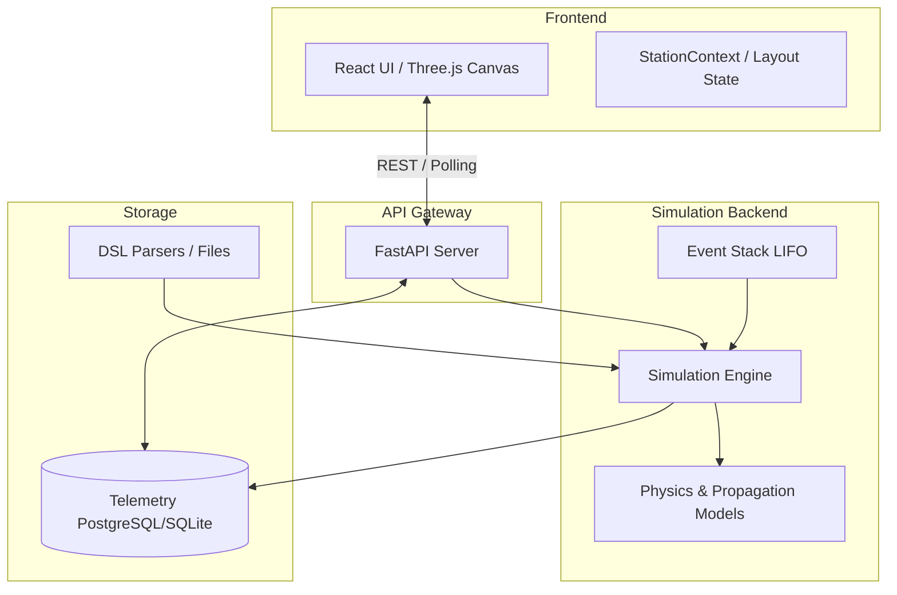

# System Architecture

The PolarTwin architecture is built upon a strong separation between the static **Model** of the physical station and the active **Runtime** state during simulations.

## Core Architecture Pillars

1. **Static Model (Twin DSL)**: The physical design of the station is defined by `.twin` files (`hierarchy.twin`, `connection.twin`, `spec.twin`). This parses into a static engineering graph and 3D layout (`SceneLayout`).
2. **Runtime Engine**: The actual state of the simulation as it runs tick-by-tick. Calculates power, heat, data flow, and cascading failures.
3. **Scenario Engine**: Processes user input (`.scene` and `.event` files) to override and simulate specific fault states (e.g., generator failure, extreme blizzards) using a LIFO stacking approach.
4. **Telemetry Subsystem**: A time-series recording of Runtime state for history queries, analytics, and scrubbing in the Diagnostics panel.
5. **Frontend Application**: A React/TypeScript application visualizing 3D spatial properties and 2D node graphs without holding authoritative physical state natively.

## Data Flow Diagram

## State Management Principles
- **No Client Authority**: The frontend never calculates physics. It only sends control instructions (play, pause, edit initial state, inject event) and reads telemetry.
- **Stateless API Routes**: The backend stores simulation states either in-memory (per run) or pushed to the Telemetry DB. 
- **Time-stepped Determinism**: The engine evaluates time linearly. Delta $t$ dictates exactly how much thermal energy or power is transferred in a single tick.
